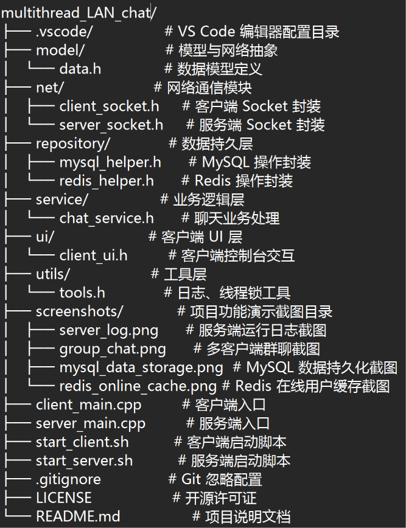
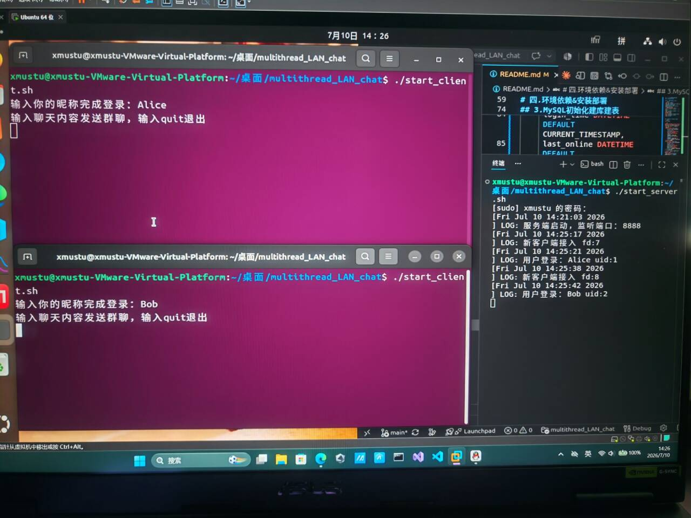
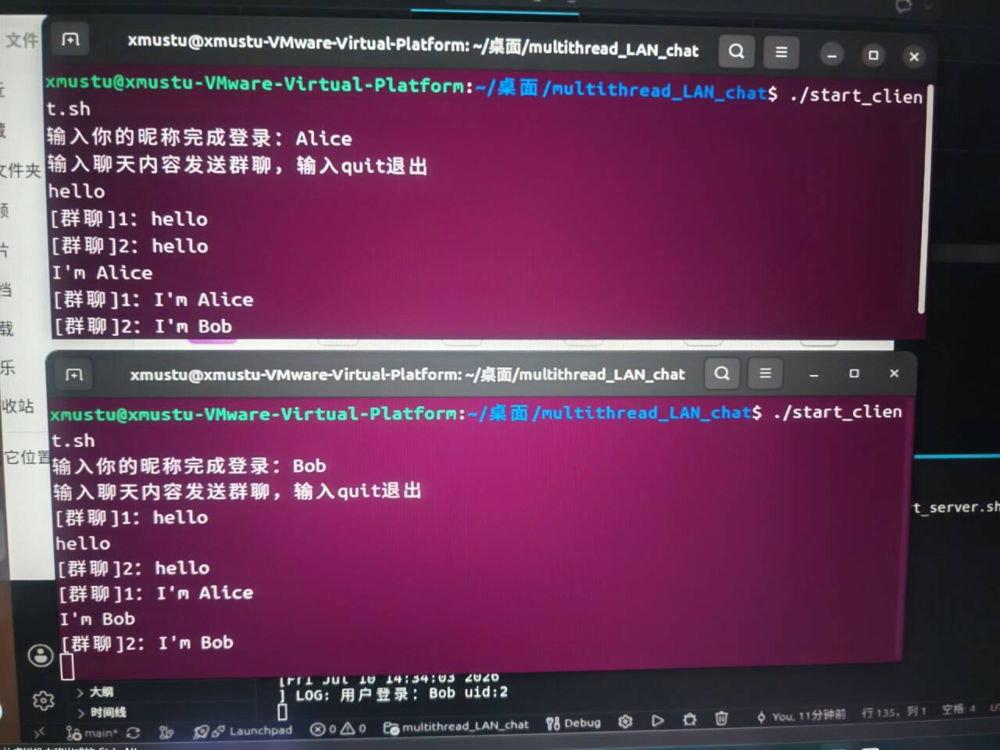
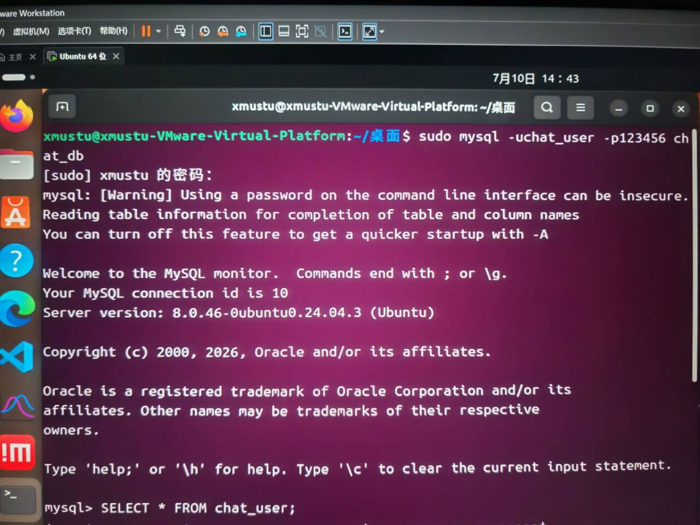
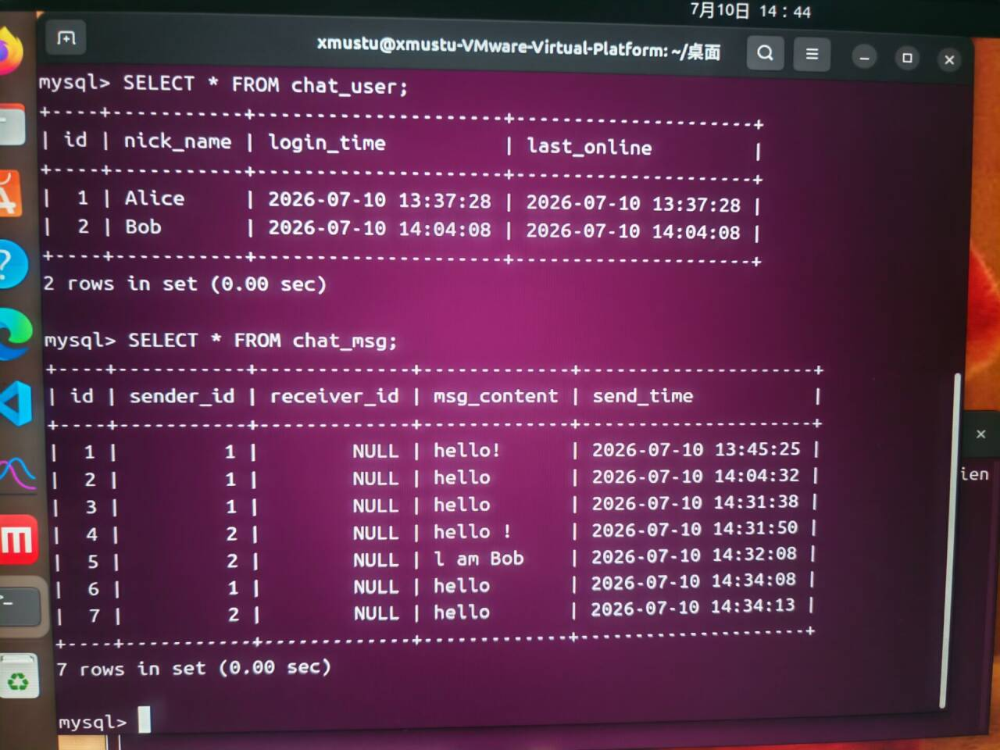
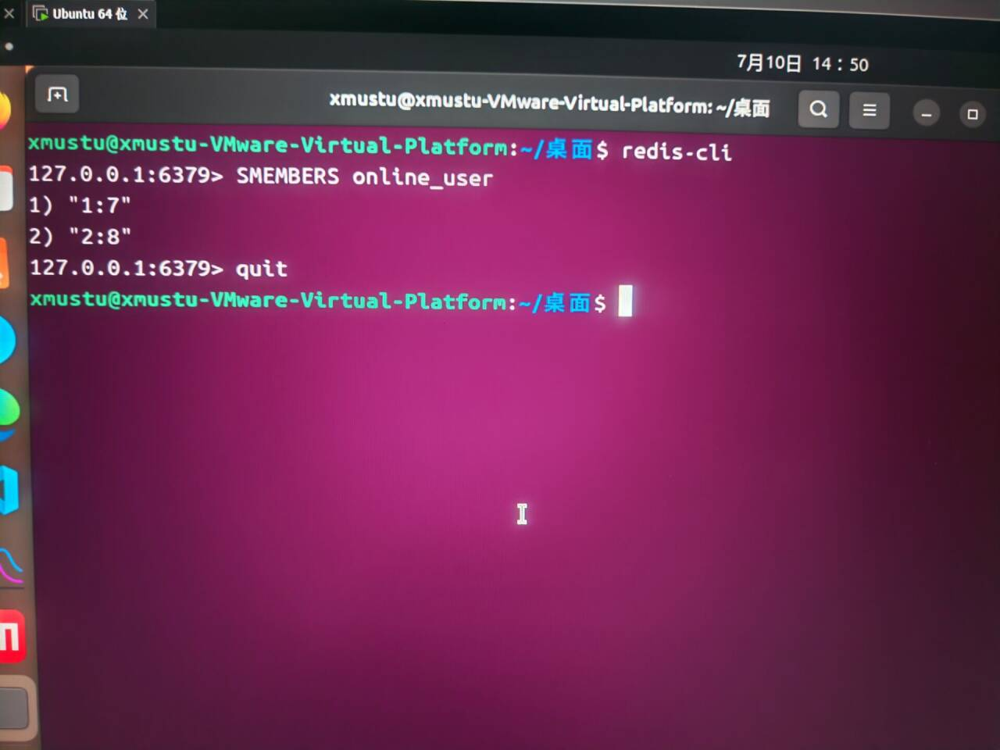

# multithread_LAN_chat
# 一.项目简介
## 1.项目名称:基于多线程的局域网即时聊天系统

## 2.项目描述:
```
本项目基于 Ubuntu Linux 平台，使用纯C++开发一款多客户端局域网TCP群聊系统。项目采用模块化分层开发，基于原生Socket + Epoll IO多路复用实现服务端并发连接管理，结合MySQL实现用户信息、聊天记录持久化存储，使用Redis缓存维护实时在线用户状态，完整实现客户端连接登录、全员群聊、消息广播、断线自动注销等基础IM核心功能，代码结构清晰、可直接编译运行。
```

## 3.核心功能
* 服务端运行日志（epoll并发连接管理）
  
* 多客户端群聊交互
  
* MySQL持久化存储数据

* Redis在线用户缓存
  
# 二.技术栈
## 1.编程语言&基础语法：
- C++17（面向对象，STL容器，多线程，互斥锁）

## 2.Linux 系统编程
 
- Linux 原生 Socket 网络编程（TCP）
​
- Epoll IO 多路复用（单线程高并发事件监听）
​
- 文件描述符管理、连接事件检测、异常资源回收
​
- 多线程编程（线程分离、异步IO处理）
 
## 3.数据库 & 缓存
 
关系型数据库（持久层）
 
- MySQL：用户信息存储、聊天记录落地、自动注册建号
 
内存缓存（热点数据）
 
- Redis：Set集合维护在线用户状态，加速在线用户查询
 
## 4.网络通信技术
 
- TCP 流式通信、服务端监听、客户端连接
​
- 全员消息广播、客户端上下线状态联动
​
- 收发分离异步通信模型
 
## 5.工程化 & 开发工具
 
- Ubuntu Linux 开发环境
​
- GCC/G++ 编译链接（pthread、mysqlclient、hiredis 动态库链接）
​
- Shell 脚本：项目一键启停
​
- Git+GitHub:代码版本管理，远程仓库托管，项目归档

- gitignore:过滤编译产物，IDE配置文件

## 6.软件架构设计
 
- 分层模块化架构（网络层/业务层/数据层/工具层/UI交互层）
​
- 解耦设计：IO逻辑、业务逻辑、存储逻辑完全分离
​
- 冷热数据分离存储：MySQL冷数据持久化、Redis热数据缓存
  
# 三.整体架构/分层设计   
## 1.项目文件夹架构


## 2.架构分层说明: 
- net：封装服务端、客户端原生Socket通信逻辑
​
- model：统一用户、消息结构体定义
​
- utils：实现带互斥锁的线程安全日志输出
​
- repository：封装MySQL、Redis数据库操作
​
- service：处理登录、广播、下线等业务逻辑
​
- ui：客户端控制台交互与多线程接收逻辑
 
所有IO、存储、业务逻辑完全分离，无冗余耦合代码。

## 3.架构特点:
- 分层架构：model → repository → service → ui，职责清晰
​
- C/S 模式：客户端与服务端分离，独立编译运行
​
- 多线程：服务端支持多客户端并发连接
​
- 双数据库：MySQL 持久化 + Redis 缓存加速
​
- 头文件为主：当前均为  .h  头文件，采用头文件实现或声明式设

# 四.环境依赖&安装部署
## 1.ubuntu24.04

## 2.一键安装全部依赖
```bash
sudo apt update
sudo apt install g++ make git libmysqlclient-dev mysql-server redis-server libhiredis-dev
启动服务并设置开机自启
sudo systemctl enable --now mysql
sudo systemctl enable --now redis-server
查看运行状态
sudo systemctl status mysql
sudo systemctl status redis-server
```

## 3.MySQL初始化建库建表
```bash
sudo mysql
```
```sql
CREATE DATABASE IF NOT EXISTS chat_db;//创建数据库chat_db
 USE chat_db;//使用数据库chat_db
 CREATE TABLE chat_user(
     id INT AUTO_INCREMENT PRIMARY KEY,
     nick_name VARCHAR(32) NOT NULL UNIQUE,
     login_time DATETIME DEFAULT CURRENT_TIMESTAMP,
     last_online DATETIME DEFAULT CURRENT_TIMESTAMP ON UPDATE CURRENT_TIMESTAMP
 );//创建用户表
 CREATE TABLE chat_msg(
     id BIGINT AUTO_INCREMENT PRIMARY KEY,
     sender_id INT,
     receiver_id INT NULL,
     msg_content TEXT,
     send_time DATETIME DEFAULT CURRENT_TIMESTAMP
 );//创建消息表
 -- 创建项目数据库账号（密码123456，和代码里配置一致）
 CREATE USER 'chat_user'@'localhost' IDENTIFIED BY '123456';
 GRANT ALL ON chat_db.* TO 'chat_user'@'localhost';
 FLUSH PRIVILEGES;
 exit;
```

# 五.编译启动运行步骤
## 1.编译命令
```bash
编译服务端
g++ server_main.cpp $(find net service repository utils model -name "*.cpp") -o chat_server -pthread -lmysqlclient -lhiredis -std=c++17
确认可执行文件生成
ls -l chat_server
编译客户端
g++ client_main.cpp $(find net ui utils model -name "*.cpp") -o chat_client -pthread -std=c++17
确认可执行文件生成
ls -l chat_client
```

## 2.项目运行
### 一键启动shell脚本
#### 终端赋可执行权限：
```bash
chmod +x start_server.sh start_client.sh
```
```bash
终端1启动服务端
./start_server.sh
新开多个终端分别启动客户端，输入昵称即可群聊
./start_client.sh
```
# 六.核心功能演示
## 1.服务端运行日志（epoll并发连接管理）


## 2.多客户端群聊交互


## 3.MySQL持久化存储数据



## 4.Redis在线用户缓存


## 七.项目收获：
```
通过从零开发本项目，熟练掌握 Linux TCP 网络编程完整流程，理解 Epoll 事件监听的使用方式，掌握「数据库持久化+缓存热点数据」的基础后端存储架构，熟悉分层模块化编程思想，能够独立完成小型Linux后端服务的开发、编译与部署。
```